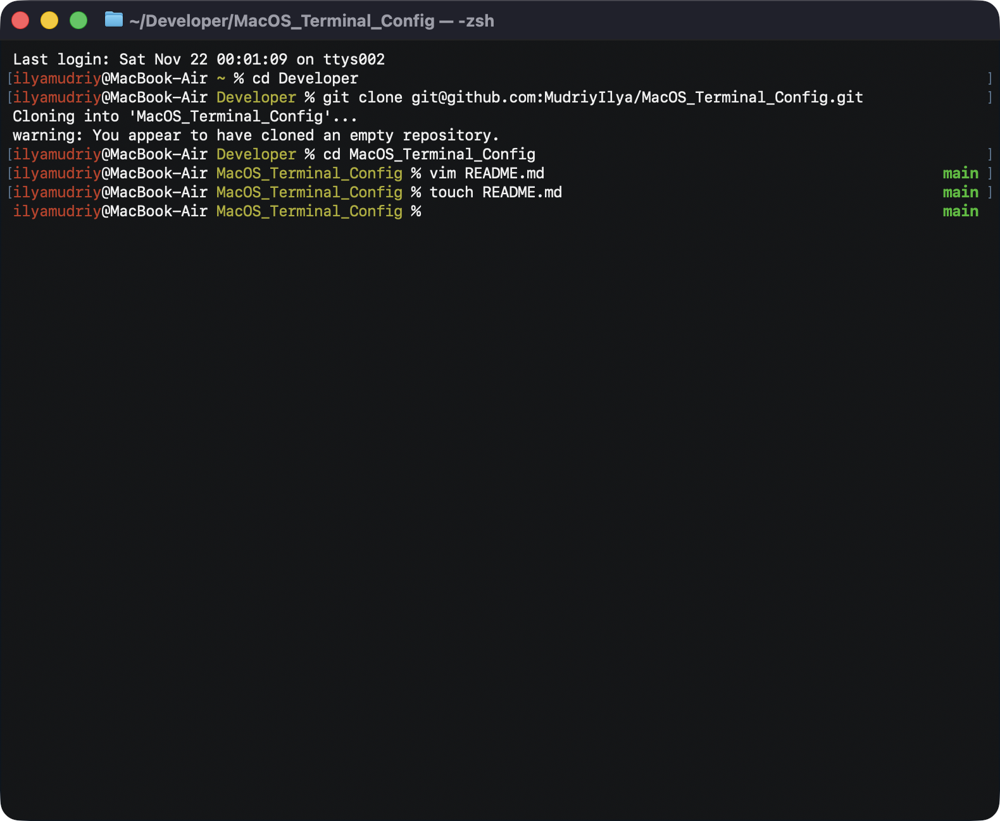
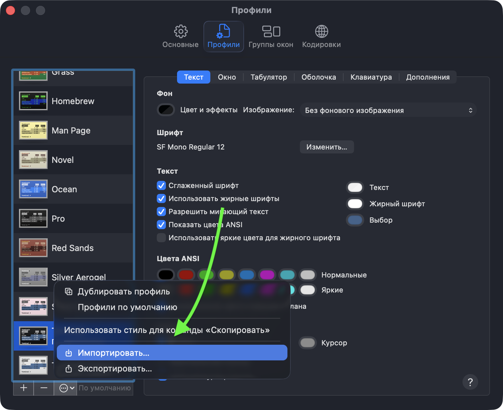
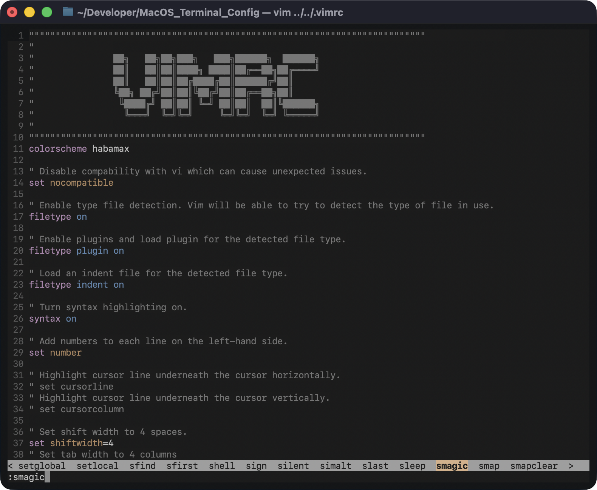

# <u>**Terminal** & **Vim** configs</u>

Settings for default MacOS Terminal and Vim.

Some companies prohibit the usage of programs that are not on the company's whitelist. Sometimes it can be programs like **homebrew** or **iTerm**.

But for your convenience you can use built-in tools. So, your cybersecurity department will be calm😌

## <u>Terminal</u>

1) Make import Terminal settings profile **Terminal.terminal**

   

2) Place **.zshrc** in user directory, example `/Users/user_name/.zshrc`

## <u>Vim</u>

Place **.vimrc** in user directory, example `/Users/user_name/.vimrc`